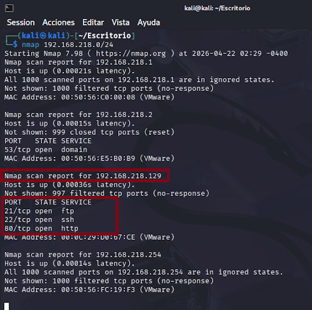
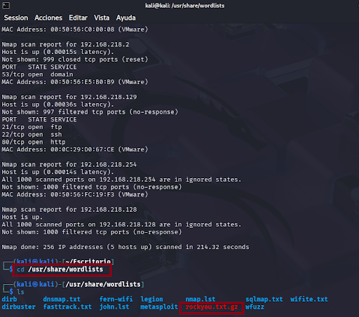
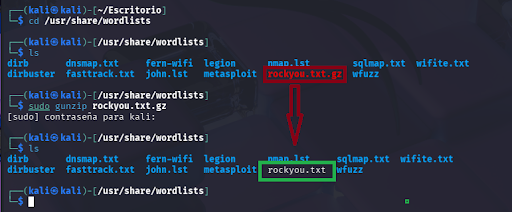
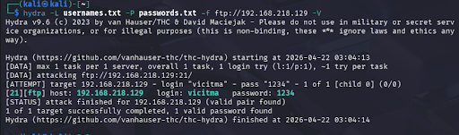
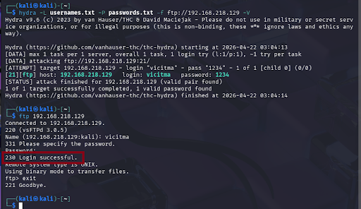
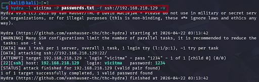
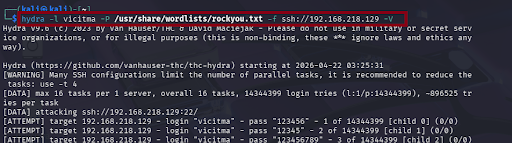
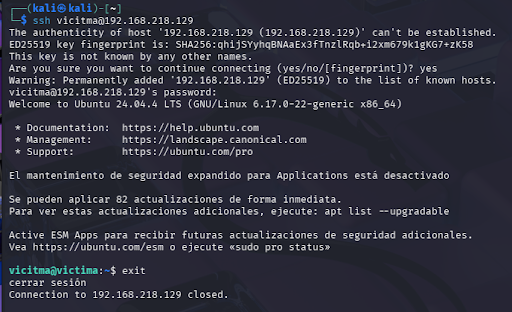

# 🔐 Ataque de diccionario con Hydra sobre FTP y SSH

En esta práctica se realiza un ataque de diccionario utilizando la herramienta Hydra desde una máquina atacante Kali Linux (192.168.218.218) contra una máquina víctima Ubuntu (192.168.218.219) con servicios FTP y SSH expuestos.

---

## 🧪 Entorno de laboratorio

- Máquina atacante: Kali Linux  
  - IP: 192.168.218.218
- Máquina víctima: Ubuntu  
  - IP: 192.168.218.219
  - Servicios habilitados: FTP, SSH y HTTP (HTTP no se utiliza en el ataque).
- Ambas máquinas están configuradas en la misma red virtual, lo que permite el escaneo directo desde la máquina Kali hacia la máquina Ubuntu.

---

## 🔎 Fase de reconocimiento

### 1. Descubrimiento de la IP de la víctima y puertos abiertos

Desde la máquina atacante (192.168.218.218) se realiza un escaneo de la red para localizar la IP de la máquina Ubuntu, dado que ambas se encuentran en la misma subred 192.168.218.0/24.  
Una vez identificado el host objetivo, se confirma que la IP de la víctima es 192.168.218.219 y se comprueba qué puertos están abiertos.

En los resultados se observa que los servicios FTP y SSH se encuentran abiertos, lo que los convierte en objetivos adecuados para un ataque de diccionario al requerir autenticación por usuario y contraseña.

---

## 📂 Preparación de diccionarios

En Kali se dispone del archivo rockyou.txt, un diccionario ampliamente utilizado en pruebas de fuerza bruta, que contiene una gran cantidad de contraseñas comunes.  
Primero se localiza el fichero dentro del sistema.

Este archivo se encuentra comprimido, por lo que es necesario descomprimirlo para poder usarlo posteriormente durante el ataque.

Sin embargo, el uso completo de rockyou.txt puede requerir un tiempo de ejecución muy largo.  
Para esta demostración se crearon dos ficheros propios con un conjunto reducido de usuarios y contraseñas, lo que permite mantener el objetivo de la práctica reduciendo los tiempos:

- Fichero de usuarios: usernames.txt  
- Fichero de contraseñas: passwords.txt

---

## ⚙️ Ataque de diccionario con Hydra

### 1. Ataque a FTP

El primer ataque se dirige al servicio FTP de la máquina víctima 192.168.218.219.  
Para ello se utiliza Hydra indicando el diccionario de usuarios, el diccionario de contraseñas, la IP de la víctima y el servicio objetivo.

Explicación del comando (a nivel conceptual):

- hydra: herramienta de ataque de fuerza bruta.  
- parámetro -L usernames.txt: lista de nombres de usuario a probar.  
- parámetro -P passwords.txt: lista de contraseñas a probar.  
- ftp://192.168.218.219: objetivo del ataque (protocolo y dirección IP de la víctima).

Tras cierto número de intentos, Hydra devuelve las credenciales válidas encontradas para el servicio FTP.  
Con estas credenciales se comprueba el acceso iniciando sesión en el servicio FTP y confirmando que la autenticación es correcta.

---

### 2. Ataque a SSH

Posteriormente se repite el ataque de diccionario contra el servicio SSH de la misma máquina víctima (192.168.218.219).  
En este caso puede utilizarse el diccionario rockyou.txt (o una versión reducida) para simular un entorno más cercano a un escenario real, en el que se prueban muchas contraseñas comunes.

En un primer momento se pueden usar diccionarios pequeños; después, se lanza el ataque empleando el diccionario rockyou.txt para ampliar el número de contraseñas probadas.

Debido al tamaño del diccionario, el ataque puede tardar un tiempo prolongado en completarse, pero finalmente Hydra reporta unas credenciales válidas.  
Para verificar el resultado se establece una sesión SSH con la cuenta comprometida desde la máquina atacante 192.168.218.218 hacia la máquina 192.168.218.219.

---

##  ✅ Resultados

- Se identificó correctamente la IP de la máquina víctima (192.168.218.219) mediante escaneo de red desde la máquina atacante (192.168.218.218).  
- Se detectaron los servicios FTP y SSH como puertos abiertos y accesibles.  
- Se prepararon los diccionarios personalizados usernames.txt y passwords.txt, y se utilizó también el diccionario rockyou.txt para realizar ataques de diccionario con Hydra.  
- Se obtuvieron credenciales válidas tanto para FTP como para SSH, confirmando la viabilidad del ataque.

---

## 📚 Conclusiones y lecciones aprendidas

- Las contraseñas débiles o muy comunes son especialmente vulnerables a ataques de fuerza bruta basados en diccionarios como rockyou.txt.  
- Es recomendable emplear contraseñas robustas, únicas y no reutilizadas en servicios expuestos a red.  
- Limitar el número de intentos de autenticación, aplicar listas blancas de IP, usar MFA y monitorizar los intentos de login son medidas efectivas para mitigar este tipo de ataques.  
- Hydra se demuestra como una herramienta útil para auditorías de seguridad en entornos controlados de laboratorio, permitiendo evaluar la fortaleza de las credenciales.

---

## 🚀 Posibles mejoras

- Probar Hydra contra otros servicios, como paneles de autenticación HTTP/HTTPS.  
- Integrar esta práctica dentro de una metodología de pentesting más amplia (reconocimiento, enumeración, explotación, post-explotación y reporting).

---

⚠️ Aviso legal:  
Esta práctica se ha realizado exclusivamente en un entorno de laboratorio controlado, con máquinas propias y autorización explícita. El uso de estas técnicas contra sistemas sin permiso es ilegal y puede tener consecuencias penales.
